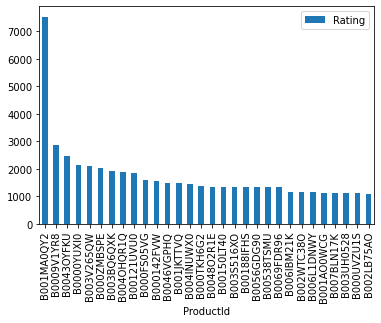
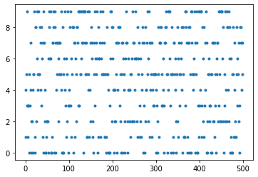

# Recommendation system for E-commerce


- [<span class="toc-section-number">1</span> Part II](#part-ii)
  - [<span class="toc-section-number">1.1</span> Model-based
    collaborative filtering
    system](#model-based-collaborative-filtering-system)
  - [<span class="toc-section-number">1.2</span> Recommendation System -
    Part III](#recommendation-system---part-iii)

- part 1: based on popularity
- part 2: model-based collaborative filtering based on customer’s
  purchase history and ratings provided by other users who bought
  similar items
- part 3: cold-start, without product rating (?)

References: -
https://www.kaggle.com/shawamar/product-recommendation-system-for-e-commerce

``` python
import matplotlib.pyplot as plt
import numpy as np
import pandas as pd
from sklearn.decomposition import TruncatedSVD

%matplotlib inline
```

``` python
amazon_ratings = pd.read_csv("./data/ratings_Beauty.csv")
amazon_ratings.head()
```

<div>
<style scoped>
    .dataframe tbody tr th:only-of-type {
        vertical-align: middle;
    }
&#10;    .dataframe tbody tr th {
        vertical-align: top;
    }
&#10;    .dataframe thead th {
        text-align: right;
    }
</style>

|     | UserId         | ProductId  | Rating | Timestamp  |
|-----|----------------|------------|--------|------------|
| 0   | A39HTATAQ9V7YF | 0205616461 | 5.0    | 1369699200 |
| 1   | A3JM6GV9MNOF9X | 0558925278 | 3.0    | 1355443200 |
| 2   | A1Z513UWSAAO0F | 0558925278 | 5.0    | 1404691200 |
| 3   | A1WMRR494NWEWV | 0733001998 | 4.0    | 1382572800 |
| 4   | A3IAAVS479H7M7 | 0737104473 | 1.0    | 1274227200 |

</div>

``` python
# Check for numerical and categorical data.
amazon_ratings.dtypes
```

    UserId        object
    ProductId     object
    Rating       float64
    Timestamp      int64
    dtype: object

``` python
# Check for null rows. None.
amazon_ratings.isnull().sum()
```

    UserId       0
    ProductId    0
    Rating       0
    Timestamp    0
    dtype: int64

``` python
# Check dataset size.
amazon_ratings.shape
```

    (2023070, 4)

``` python
amazon_ratings.columns
```

    Index(['UserId', 'ProductId', 'Rating', 'Timestamp'], dtype='object')

``` python
# Why not using the mean of ratings? Because one product with 5-star rating can rank higher than one product with 10 5-star but 1 1-star rating.
popular_products = pd.DataFrame(amazon_ratings.groupby("ProductId")["Rating"].count())
most_popular = popular_products.sort_values("Rating", ascending=False)
most_popular.head(10)
```

<div>
<style scoped>
    .dataframe tbody tr th:only-of-type {
        vertical-align: middle;
    }
&#10;    .dataframe tbody tr th {
        vertical-align: top;
    }
&#10;    .dataframe thead th {
        text-align: right;
    }
</style>

|            | Rating |
|------------|--------|
| ProductId  |        |
| B001MA0QY2 | 7533   |
| B0009V1YR8 | 2869   |
| B0043OYFKU | 2477   |
| B0000YUXI0 | 2143   |
| B003V265QW | 2088   |
| B000ZMBSPE | 2041   |
| B003BQ6QXK | 1918   |
| B004OHQR1Q | 1885   |
| B00121UVU0 | 1838   |
| B000FS05VG | 1589   |

</div>

``` python
most_popular.head(30).plot(kind="bar")
```



#### Analysis

- Popular products can be defined by products that are rated the most
  (not the highest rating)

# Part II

## Model-based collaborative filtering system

``` python
# Subset of Amazon Ratings

amazon_ratings_small = amazon_ratings.head(10000)
```

#### Utility matrix based on products sold and user reviews

Utility matrix consists of all possible user-item preferences (ratings)
represented as a matrix. The utility matrix is sparse - no users would
buy all items in the list.

``` python
ratings_utility_matrix = amazon_ratings_small.pivot_table(
    values="Rating", index="UserId", columns="ProductId", fill_value=0
)
ratings_utility_matrix.head()
```

<div>
<style scoped>
    .dataframe tbody tr th:only-of-type {
        vertical-align: middle;
    }
&#10;    .dataframe tbody tr th {
        vertical-align: top;
    }
&#10;    .dataframe thead th {
        text-align: right;
    }
</style>

| ProductId | 0205616461 | 0558925278 | 0733001998 | 0737104473 | 0762451459 | 1304139212 | 1304139220 | 130414089X | 130414643X | 1304146537 | ... | B000052YPE | B000052YPF | B000052YPG | B000052YPH | B000052YPM | B000052YPU | B000052YPV | B000052YPY | B000052YQ0 | B000052YQ2 |
|----|----|----|----|----|----|----|----|----|----|----|----|----|----|----|----|----|----|----|----|----|----|
| UserId |  |  |  |  |  |  |  |  |  |  |  |  |  |  |  |  |  |  |  |  |  |
| A00205921JHJK5X9LNP42 | 0 | 0 | 0 | 0 | 0 | 0 | 0 | 0 | 0 | 0 | ... | 0 | 0 | 0 | 0 | 0 | 0 | 0 | 0 | 0 | 0 |
| A024581134CV80ZBLIZTZ | 0 | 0 | 0 | 0 | 0 | 0 | 0 | 0 | 0 | 0 | ... | 0 | 0 | 0 | 0 | 0 | 0 | 0 | 0 | 0 | 0 |
| A03056581JJIOL5FSKJY7 | 0 | 0 | 0 | 0 | 0 | 0 | 0 | 0 | 0 | 0 | ... | 0 | 0 | 0 | 0 | 0 | 0 | 0 | 0 | 0 | 0 |
| A03099101ZRK4K607JVHH | 0 | 0 | 0 | 0 | 0 | 0 | 0 | 0 | 0 | 0 | ... | 0 | 0 | 0 | 0 | 0 | 0 | 0 | 0 | 0 | 0 |
| A0505229A7NSH3FRXRR4 | 0 | 0 | 0 | 0 | 0 | 0 | 0 | 0 | 0 | 0 | ... | 0 | 0 | 0 | 0 | 0 | 0 | 0 | 0 | 0 | 0 |

<p>5 rows × 886 columns</p>
</div>

``` python
ratings_utility_matrix.shape
```

    (9697, 886)

``` python
X = ratings_utility_matrix.T
X.shape
```

    (886, 9697)

``` python
# Decomposing the matrix.
svd = TruncatedSVD(n_components=10, random_state=10)
decomposed_matrix = svd.fit_transform(X)
decomposed_matrix.shape
```

    (886, 10)

``` python
# Correlation matrix
correlation_matrix = np.corrcoef(decomposed_matrix)
correlation_matrix.shape
```

    (886, 886)

``` python
# Assuming the customers buy product id `6117036094` (randomly choosen)
product_id = X.index[99]
product_id
```

    '6117036094'

``` python
product_names = list(X.index)
product_names[:5]
```

    ['0205616461', '0558925278', '0733001998', '0737104473', '0762451459']

``` python
product_idx = product_names.index(product_id)
product_idx
```

    99

``` python
correlation_product_id = correlation_matrix[product_idx]
correlation_product_id.shape
```

    (886,)

Recommending top 10 highly correlated products in sequence.

``` python
recommendations = list(X.index[correlation_product_id > 0.90])

# Remove the item already bought by the customer.
recommendations.remove(product_id)

recommendations[:10]
```

    ['0733001998',
     '0762451459',
     '1304139212',
     '1304139220',
     '130414643X',
     '130414674X',
     '1304174778',
     '1304174867',
     '1304174905',
     '1304196046']

## Recommendation System - Part III

- For a business without any user-item purchase history, a search engine
  based recommendation engine can be designed for users. THe product
  recommendations can be based on textual clustering analysis given in
  product description.

``` python
from sklearn.cluster import KMeans
from sklearn.feature_extraction.text import CountVectorizer, TfidfVectorizer
from sklearn.metrics import adjusted_rand_score
from sklearn.neighbors import NearestNeighbors
```

#### Item to item based recommendation system based on product description

``` python
product_descriptions = pd.read_csv("./data/product_descriptions.csv")
product_descriptions.shape
```

    (124428, 2)

#### Check for missing values

``` python
product_descriptions.dropna(inplace=True)
product_descriptions.isnull().sum()
```

    product_uid            0
    product_description    0
    dtype: int64

``` python
product_descriptions.head()
```

<div>
<style scoped>
    .dataframe tbody tr th:only-of-type {
        vertical-align: middle;
    }
&#10;    .dataframe tbody tr th {
        vertical-align: top;
    }
&#10;    .dataframe thead th {
        text-align: right;
    }
</style>

|     | product_uid | product_description                               |
|-----|-------------|---------------------------------------------------|
| 0   | 100001      | Not only do angles make joints stronger, they ... |
| 1   | 100002      | BEHR Premium Textured DECKOVER is an innovativ... |
| 2   | 100003      | Classic architecture meets contemporary design... |
| 3   | 100004      | The Grape Solar 265-Watt Polycrystalline PV So... |
| 4   | 100005      | Update your bathroom with the Delta Vero Singl... |

</div>

``` python
product_descriptions_small = product_descriptions.head(500)
product_descriptions_small["product_description"].head()
```

    0    Not only do angles make joints stronger, they ...
    1    BEHR Premium Textured DECKOVER is an innovativ...
    2    Classic architecture meets contemporary design...
    3    The Grape Solar 265-Watt Polycrystalline PV So...
    4    Update your bathroom with the Delta Vero Singl...
    Name: product_description, dtype: object

#### Feature extraction from product descriptions

``` python
vectorizer = TfidfVectorizer(stop_words="english")
X = vectorizer.fit_transform(product_descriptions_small["product_description"])
X
```

    <500x8932 sparse matrix of type '<class 'numpy.float64'>'
        with 34817 stored elements in Compressed Sparse Row format>

#### Visualizing product clusters in subset of data

``` python
# Fitting k-means to dataset.

kmeans = KMeans(n_clusters=10, init="k-means++", random_state=0)
y_kmeans = kmeans.fit_predict(X)
plt.plot(y_kmeans, ".")
plt.show()
```



``` python
def print_cluster(i):
    print("Cluster {}:".format(i))
    for ind in order_centroids[i, :10]:
        print(" ", terms[ind])
    print
```

``` python
# Optimal clusters can be obtained from elbow method.
true_k = 10
model = KMeans(n_clusters=true_k, init="k-means++", max_iter=100, n_init=1)
model.fit(X)

print("Top term per cluster:")
order_centroids = model.cluster_centers_.argsort()[:, ::-1]
terms = vectorizer.get_feature_names()
for i in range(true_k):
    print_cluster(i)
```

    Top term per cluster:
    Cluster 0:
      concrete
      stake
      used
      steel
      grip
      pliers
      head
      sprinkler
      cement
      garden
    Cluster 1:
      door
      ft
      wood
      painted
      proposition
      nbsp
      residents
      california
      65
      post
    Cluster 2:
      light
      water
      watt
      led
      installation
      heater
      energy
      year
      bulb
      easy
    Cluster 3:
      paint
      water
      easy
      roller
      handle
      ft
      brush
      use
      smooth
      provides
    Cluster 4:
      finish
      furniture
      paint
      available
      wood
      using
      includes
      look
      waxes
      dog
    Cluster 5:
      metal
      storage
      shelves
      shelf
      unit
      steel
      durable
      adjustable
      lbs
      kitchen
    Cluster 6:
      power
      air
      cutting
      volt
      control
      cooling
      20
      easy
      plan
      tool
    Cluster 7:
      rug
      bamboo
      shades
      vary
      order
      slightly
      natural
      product
      collection
      size
    Cluster 8:
      piece
      toilet
      tile
      design
      flush
      water
      bowl
      insulation
      use
      installation
    Cluster 9:
      wall
      plate
      posts
      fence
      post
      panels
      center
      connect
      speaker
      screws

#### Predicting clusters based on key search words.

``` python
def show_recommendations(product):
    X = vectorizer.transform([product])
    preds = model.predict(X)
    print_cluster(preds[0])
```

**Keyword**: cutting tool

``` python
show_recommendations("cutting tool")
```

    Cluster 6:
      power
      air
      cutting
      volt
      control
      cooling
      20
      easy
      plan
      tool

**Keyword**: spray paint

``` python
show_recommendations("spray paint")
```

    Cluster 3:
      paint
      water
      easy
      roller
      handle
      ft
      brush
      use
      smooth
      provides

In case a word appears in multiple clusters, the algorithm chooses the
cluster with the highest frequency of occurance of the word

Once a cluster is identified based on the user’s search words, the
recommendations system can display items from the corresponding product
cluster based on the product descriptions
