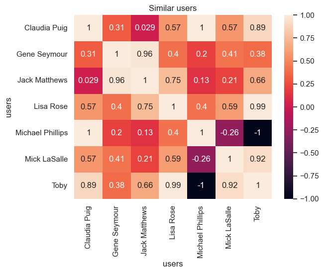

``` python
import pandas as pd
```

``` python
df = pd.read_csv("rating2.csv")
df.head()
```

<div>
<style scoped>
    .dataframe tbody tr th:only-of-type {
        vertical-align: middle;
    }
&#10;    .dataframe tbody tr th {
        vertical-align: top;
    }
&#10;    .dataframe thead th {
        text-align: right;
    }
</style>

|     | users     | movies             | ratings |
|-----|-----------|--------------------|---------|
| 0   | Lisa Rose | Lady in the Water  | 2.5     |
| 1   | Lisa Rose | Snakes on a Plane  | 3.5     |
| 2   | Lisa Rose | Just My Luck       | 3.0     |
| 3   | Lisa Rose | Superman Returns   | 3.5     |
| 4   | Lisa Rose | You, Me and Dupree | 2.5     |

</div>

``` python
# Every row is a user and every column is the items. If there are no ratings, leave it as NA
utility_matrix = df.pivot(index="users", columns="movies", values="ratings")
# .fillna(0) Avoid filling with 0, as .corr() skips only N/A or NULL values, but not 0.

# Remove the index to be able to query the table, and also set the 'users' column as the index.
# utility_matrix = utility_matrix.reset_index().rename_axis(None, axis=1)

utility_matrix
```

<div>
<style scoped>
    .dataframe tbody tr th:only-of-type {
        vertical-align: middle;
    }
&#10;    .dataframe tbody tr th {
        vertical-align: top;
    }
&#10;    .dataframe thead th {
        text-align: right;
    }
</style>

| movies | Just My Luck | Lady in the Water | Snakes on a Plane | Superman Returns | The Night Listener | You, Me and Dupree |
|----|----|----|----|----|----|----|
| users |  |  |  |  |  |  |
| Claudia Puig | 3.0 | NaN | 3.5 | 4.0 | 4.5 | 2.5 |
| Gene Seymour | 1.5 | 3.0 | 3.5 | 5.0 | 3.0 | 3.5 |
| Jack Matthews | NaN | 3.0 | 4.0 | 5.0 | 3.0 | 3.5 |
| Lisa Rose | 3.0 | 2.5 | 3.5 | 3.5 | 3.0 | 2.5 |
| Michael Phillips | NaN | 2.5 | 3.0 | 3.5 | 4.0 | NaN |
| Mick LaSalle | 2.0 | 3.0 | 4.0 | 3.0 | 3.0 | 2.0 |
| Toby | NaN | NaN | 4.5 | 4.0 | NaN | 1.0 |

</div>

``` python
# pandas.corr() finds the pearson correlation between all columns.
# So for a given utility (user-item) matrix where each row is a user and each column
# are items with ratings (or NaN), we transpose the utility matrix before calling .corr()
def recommend(utility_matrix, target, n=5, user_based=True):
    X = utility_matrix
    if user_based:
        X = X.T

    if target not in X.columns:
        return None

    matches = X.corr()[target].sort_values(ascending=False)
    matches = matches.drop(target).head(n)

    return list(zip(matches.index, matches.values))
```

``` python
users = utility_matrix.index
toby = users[6]
recommend(utility_matrix, toby)
```

    [('Lisa Rose', np.float64(0.9912407071619305)),
     ('Mick LaSalle', np.float64(0.924473451641905)),
     ('Claudia Puig', np.float64(0.8934051474415641)),
     ('Jack Matthews', np.float64(0.6628489803598702)),
     ('Gene Seymour', np.float64(0.3812464258315117))]

``` python
items = utility_matrix.columns
superman_returns = items[3]
recommend(utility_matrix, superman_returns, user_based=False)
```

    [('You, Me and Dupree', np.float64(0.6579516949597689)),
     ('Lady in the Water', np.float64(0.48795003647426655)),
     ('Snakes on a Plane', np.float64(0.1118033988749894)),
     ('The Night Listener', np.float64(-0.1798471947990542)),
     ('Just My Luck', np.float64(-0.4228900316110311))]

``` python
utility_matrix.T.corr()
```

<div>
<style scoped>
    .dataframe tbody tr th:only-of-type {
        vertical-align: middle;
    }
&#10;    .dataframe tbody tr th {
        vertical-align: top;
    }
&#10;    .dataframe thead th {
        text-align: right;
    }
</style>

| users | Claudia Puig | Gene Seymour | Jack Matthews | Lisa Rose | Michael Phillips | Mick LaSalle | Toby |
|----|----|----|----|----|----|----|----|
| users |  |  |  |  |  |  |  |
| Claudia Puig | 1.000000 | 0.314970 | 0.028571 | 0.566947 | 1.000000 | 0.566947 | 0.893405 |
| Gene Seymour | 0.314970 | 1.000000 | 0.963796 | 0.396059 | 0.204598 | 0.411765 | 0.381246 |
| Jack Matthews | 0.028571 | 0.963796 | 1.000000 | 0.747018 | 0.134840 | 0.211289 | 0.662849 |
| Lisa Rose | 0.566947 | 0.396059 | 0.747018 | 1.000000 | 0.404520 | 0.594089 | 0.991241 |
| Michael Phillips | 1.000000 | 0.204598 | 0.134840 | 0.404520 | 1.000000 | -0.258199 | -1.000000 |
| Mick LaSalle | 0.566947 | 0.411765 | 0.211289 | 0.594089 | -0.258199 | 1.000000 | 0.924473 |
| Toby | 0.893405 | 0.381246 | 0.662849 | 0.991241 | -1.000000 | 0.924473 | 1.000000 |

</div>

``` python
def top_matches(utility_matrix, idx, n=5, debug=False):
    corr = utility_matrix.corr()
    columns = corr.T.index  # Note that the column is transposed.

    if debug:
        print("Similar movies for: {}\n".format(columns[idx]))
        print(corr[columns[idx]].sort_values(ascending=False))

    matches = columns[corr[columns[idx]].values.argsort()[::-1]].tolist()

    # Remove the current target to match the recommendation against.
    matches.remove(columns[idx])

    return columns[idx], matches[:n]
```

``` python
target, matches = top_matches(utility_matrix.T, 6, debug=True)
print("\nSimilar users to {}:".format(target))
for i, user in enumerate(matches):
    print("{}. {}".format(i + 1, user))
```

    Similar movies for: Toby

    users
    Toby                1.000000
    Lisa Rose           0.991241
    Mick LaSalle        0.924473
    Claudia Puig        0.893405
    Jack Matthews       0.662849
    Gene Seymour        0.381246
    Michael Phillips   -1.000000
    Name: Toby, dtype: float64

    Similar users to Toby:
    1. Lisa Rose
    2. Mick LaSalle
    3. Claudia Puig
    4. Jack Matthews
    5. Gene Seymour

``` python
target, matches = top_matches(utility_matrix, 3, debug=True)
print("\nSimilar movies to {}:".format(target))
for i, user in enumerate(matches):
    print("{}. {}".format(i + 1, user))
```

    Similar movies for: Superman Returns

    movies
    Superman Returns      1.000000
    You, Me and Dupree    0.657952
    Lady in the Water     0.487950
    Snakes on a Plane     0.111803
    The Night Listener   -0.179847
    Just My Luck         -0.422890
    Name: Superman Returns, dtype: float64

    Similar movies to Superman Returns:
    1. You, Me and Dupree
    2. Lady in the Water
    3. Snakes on a Plane
    4. The Night Listener
    5. Just My Luck

``` python
import matplotlib.pyplot as plt
import seaborn as sns

sns.set()
```

``` python
sns.heatmap(utility_matrix.T.corr(), annot=True)
plt.title("Similar users");
```



``` python
sns.heatmap(utility_matrix.corr(), annot=True)
plt.title("Similar movies");
```


``` python
from sklearn.decomposition import NMF, TruncatedSVD

# TruncatedSVD does not deal with missing data, and setting it to 0 is not accurate.
X = utility_matrix.fillna(0)
model = TruncatedSVD(n_components=5, random_state=0)
decomposed_matrix = model.fit_transform(X)
```

``` python
X.shape
```

    (7, 6)

``` python
idx = 6
X.index[idx]
```

    'Toby'

``` python
import numpy as np

# Correlation matrix
correlation_matrix = np.corrcoef(decomposed_matrix)
correlation_matrix.shape
```

    (7, 7)

``` python
pd.DataFrame(
    {
        "movies": X.index,
        "score": correlation_matrix[idx],
    }
).sort_values(by="score", ascending=False)
```

<div>
<style scoped>
    .dataframe tbody tr th:only-of-type {
        vertical-align: middle;
    }
&#10;    .dataframe tbody tr th {
        vertical-align: top;
    }
&#10;    .dataframe thead th {
        text-align: right;
    }
</style>

|     | movies           | score    |
|-----|------------------|----------|
| 6   | Toby             | 1.000000 |
| 5   | Mick LaSalle     | 0.913975 |
| 2   | Jack Matthews    | 0.882745 |
| 1   | Gene Seymour     | 0.882089 |
| 3   | Lisa Rose        | 0.873134 |
| 0   | Claudia Puig     | 0.736670 |
| 4   | Michael Phillips | 0.734033 |

</div>

Similar users to Toby:

1.  Lisa Rose
2.  Mick LaSalle
3.  Claudia Puig
4.  Jack Matthews
5.  Gene Seymour

``` python
# Matrix Factorization
# NMF does not deal with missing data, and setting it to 0 is not accurate.
# https://github.com/scikit-learn/scikit-learn/issues/8447
# The solution is to drop those with NA, but that's not what we want to achieve since we want to predict the ratings with matrix factorization.
X = utility_matrix.fillna(0)
model = NMF(n_components=X.shape[0], init="random", random_state=0)
W = model.fit_transform(X)
H = model.components_
nR = np.dot(W, H)
nR
```

    array([[2.99992519e+00, 1.63004041e-04, 3.49995716e+00, 4.00046684e+00,
            4.49997688e+00, 2.50015944e+00],
           [1.49985882e+00, 3.00000747e+00, 3.50003258e+00, 4.99992248e+00,
            3.00003259e+00, 3.50006241e+00],
           [5.22969211e-06, 3.00003230e+00, 3.99994427e+00, 4.99988801e+00,
            3.00002924e+00, 3.50001314e+00],
           [2.99997763e+00, 2.49995313e+00, 3.50009691e+00, 3.50021056e+00,
            3.00003544e+00, 2.49992782e+00],
           [2.29103417e-07, 2.50016001e+00, 2.99993601e+00, 3.49937928e+00,
            4.00013175e+00, 4.51301577e-03],
           [2.00015391e+00, 2.99986324e+00, 3.99999153e+00, 3.00048013e+00,
            3.00000121e+00, 1.99980952e+00],
           [5.07410523e-05, 3.11260092e-04, 4.50003321e+00, 3.99968809e+00,
            3.11251638e-04, 9.99879961e-01]])

``` python
X.index[nR[idx].argsort()[::-1]]
```

    Index(['Jack Matthews', 'Lisa Rose', 'Mick LaSalle', 'Gene Seymour',
           'Michael Phillips', 'Claudia Puig'],
          dtype='object', name='users')

``` python
# TODO: Check surprise matrix factorization.
# https://surprise.readthedocs.io/en/stable/matrix_factorization.html
```

``` python
nR = np.dot(W[idx], H)
X.index[nR.argsort()[::-1]]
```

    Index(['Jack Matthews', 'Lisa Rose', 'Mick LaSalle', 'Gene Seymour',
           'Michael Phillips', 'Claudia Puig'],
          dtype='object', name='users')

``` python
W[idx]
```

    array([3.44166086e-04, 0.00000000e+00, 0.00000000e+00, 1.60906273e+00,
           0.00000000e+00, 3.00694404e+00, 0.00000000e+00])

``` python
# Since we have "learned" the latent features through SVD, we can now generate ratings and find similar users to existing user pool.
print("Ratings for ", X.columns)
nR = np.dot([4, 0, 0, 2, 0, 3, 0], H)
X.index[nR.argsort()[::-1]]
```

    Ratings for  Index(['Just My Luck', 'Lady in the Water', 'Snakes on a Plane',
           'Superman Returns', 'The Night Listener', 'You, Me and Dupree'],
          dtype='object', name='movies')

    Index(['Lisa Rose', 'Jack Matthews', 'Mick LaSalle', 'Gene Seymour',
           'Michael Phillips', 'Claudia Puig'],
          dtype='object', name='users')
