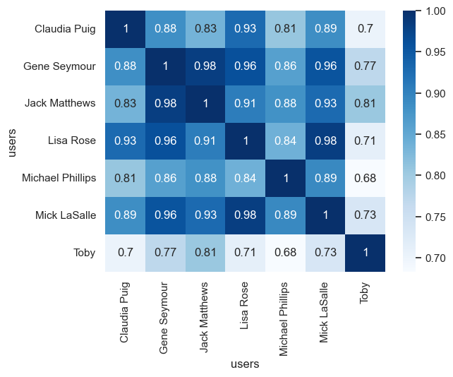

# Recommendation using implicit library


- [<span class="toc-section-number">1</span> Computing cosine
  similarity](#computing-cosine-similarity)
  - [<span class="toc-section-number">1.1</span> Using
    sklearn](#using-sklearn)
  - [<span class="toc-section-number">1.2</span> Using
    implicit](#using-implicit)
  - [<span class="toc-section-number">1.3</span> Finding item-item
    similarities](#finding-item-item-similarities)
- [<span class="toc-section-number">2</span> Alternative Least
  Squares](#alternative-least-squares)

``` python
import pandas as pd
import seaborn as sns
from implicit.nearest_neighbours import CosineRecommender
from scipy.sparse import coo_matrix, csr_matrix
from sklearn.metrics.pairwise import cosine_distances, cosine_similarity
from sklearn.preprocessing import normalize

sns.set()
```

``` python
# Load data
df = pd.read_csv("rating2.csv")
df.head()
```

<div>
<style scoped>
    .dataframe tbody tr th:only-of-type {
        vertical-align: middle;
    }
&#10;    .dataframe tbody tr th {
        vertical-align: top;
    }
&#10;    .dataframe thead th {
        text-align: right;
    }
</style>

|     | users     | movies             | ratings |
|-----|-----------|--------------------|---------|
| 0   | Lisa Rose | Lady in the Water  | 2.5     |
| 1   | Lisa Rose | Snakes on a Plane  | 3.5     |
| 2   | Lisa Rose | Just My Luck       | 3.0     |
| 3   | Lisa Rose | Superman Returns   | 3.5     |
| 4   | Lisa Rose | You, Me and Dupree | 2.5     |

</div>

``` python
user_items = df.pivot(columns="movies", index="users", values="ratings")
user_items
```

<div>
<style scoped>
    .dataframe tbody tr th:only-of-type {
        vertical-align: middle;
    }
&#10;    .dataframe tbody tr th {
        vertical-align: top;
    }
&#10;    .dataframe thead th {
        text-align: right;
    }
</style>

| movies | Just My Luck | Lady in the Water | Snakes on a Plane | Superman Returns | The Night Listener | You, Me and Dupree |
|----|----|----|----|----|----|----|
| users |  |  |  |  |  |  |
| Claudia Puig | 3.0 | NaN | 3.5 | 4.0 | 4.5 | 2.5 |
| Gene Seymour | 1.5 | 3.0 | 3.5 | 5.0 | 3.0 | 3.5 |
| Jack Matthews | NaN | 3.0 | 4.0 | 5.0 | 3.0 | 3.5 |
| Lisa Rose | 3.0 | 2.5 | 3.5 | 3.5 | 3.0 | 2.5 |
| Michael Phillips | NaN | 2.5 | 3.0 | 3.5 | 4.0 | NaN |
| Mick LaSalle | 2.0 | 3.0 | 4.0 | 3.0 | 3.0 | 2.0 |
| Toby | NaN | NaN | 4.5 | 4.0 | NaN | 1.0 |

</div>

## Computing cosine similarity

### Using sklearn

``` python
# Fill NaN values with 0, because cosine similarity doesn't allow NaN values.
claudia = user_items.iloc[0].fillna(0).values
gene = user_items.iloc[1].fillna(0).values


cosine_similarity([claudia], [gene])
```

    array([[0.8847892]])

``` python
df = pd.DataFrame(
    cosine_similarity(user_items.fillna(0)),
    index=user_items.index,
    columns=user_items.index,
)
df.head(n=10)
```

<div>
<style scoped>
    .dataframe tbody tr th:only-of-type {
        vertical-align: middle;
    }
&#10;    .dataframe tbody tr th {
        vertical-align: top;
    }
&#10;    .dataframe thead th {
        text-align: right;
    }
</style>

| users | Claudia Puig | Gene Seymour | Jack Matthews | Lisa Rose | Michael Phillips | Mick LaSalle | Toby |
|----|----|----|----|----|----|----|----|
| users |  |  |  |  |  |  |  |
| Claudia Puig | 1.000000 | 0.884789 | 0.834622 | 0.928841 | 0.807057 | 0.885658 | 0.702841 |
| Gene Seymour | 0.884789 | 1.000000 | 0.982325 | 0.960646 | 0.862337 | 0.955691 | 0.770024 |
| Jack Matthews | 0.834622 | 0.982325 | 1.000000 | 0.906551 | 0.880155 | 0.928989 | 0.805550 |
| Lisa Rose | 0.928841 | 0.960646 | 0.906551 | 1.000000 | 0.838220 | 0.981831 | 0.712501 |
| Michael Phillips | 0.807057 | 0.862337 | 0.880155 | 0.838220 | 1.000000 | 0.891702 | 0.683164 |
| Mick LaSalle | 0.885658 | 0.955691 | 0.928989 | 0.981831 | 0.891702 | 1.000000 | 0.734179 |
| Toby | 0.702841 | 0.770024 | 0.805550 | 0.712501 | 0.683164 | 0.734179 | 1.000000 |

</div>

``` python
sns.heatmap(df, annot=True, cmap="Blues");
```



``` python
# Finding similar users
user = "Toby"
n = 5

users = df.loc[user].sort_values(ascending=False).drop(user).head(n)
users
```

    users
    Jack Matthews    0.805550
    Gene Seymour     0.770024
    Mick LaSalle     0.734179
    Lisa Rose        0.712501
    Claudia Puig     0.702841
    Name: Toby, dtype: float64

``` python
# 1 - cosine_similarity
cosine_distances([claudia], [gene])
```

    array([[0.1152108]])

``` python
1 - cosine_distances([claudia], [gene])
```

    array([[0.8847892]])

### Using implicit

``` python
df = pd.read_csv("rating2.csv")
df["users"] = df["users"].astype("category")
df["movies"] = df["movies"].astype("category")

users = df.users.cat.categories
movies = df.movies.cat.categories

user_ids = df.users.cat.codes
movie_ids = df.movies.cat.codes

ratings = df.ratings.astype(float)

df.head()
```

<div>
<style scoped>
    .dataframe tbody tr th:only-of-type {
        vertical-align: middle;
    }
&#10;    .dataframe tbody tr th {
        vertical-align: top;
    }
&#10;    .dataframe thead th {
        text-align: right;
    }
</style>

|     | users     | movies             | ratings |
|-----|-----------|--------------------|---------|
| 0   | Lisa Rose | Lady in the Water  | 2.5     |
| 1   | Lisa Rose | Snakes on a Plane  | 3.5     |
| 2   | Lisa Rose | Just My Luck       | 3.0     |
| 3   | Lisa Rose | Superman Returns   | 3.5     |
| 4   | Lisa Rose | You, Me and Dupree | 2.5     |

</div>

``` python
import numpy as np

(list(zip(np.unique(movie_ids), movies[np.unique(movie_ids)])))
```

    [(np.int8(0), 'Just My Luck'),
     (np.int8(1), 'Lady in the Water'),
     (np.int8(2), 'Snakes on a Plane'),
     (np.int8(3), 'Superman Returns'),
     (np.int8(4), 'The Night Listener'),
     (np.int8(5), 'You, Me and Dupree')]

``` python
(list(zip(np.unique(user_ids), users[np.unique(user_ids)])))
```

    [(np.int8(0), 'Claudia Puig'),
     (np.int8(1), 'Gene Seymour'),
     (np.int8(2), 'Jack Matthews'),
     (np.int8(3), 'Lisa Rose'),
     (np.int8(4), 'Michael Phillips'),
     (np.int8(5), 'Mick LaSalle'),
     (np.int8(6), 'Toby')]

``` python
user_items = coo_matrix((ratings, (user_ids, movie_ids))).tocsr()
user_items
```

    <Compressed Sparse Row sparse matrix of dtype 'float64'
        with 35 stored elements and shape (7, 6)>

``` python
# This computes similarities for each items.
model = CosineRecommender()
model.fit(user_items)
```

    /Users/alextanhongpin/Documents/go/recommender-learn/.venv/lib/python3.12/site-packages/implicit/utils.py:164: ParameterWarning: Method expects CSR input, and was passed coo_matrix instead. Converting to CSR took 6.818771362304688e-05 seconds
      warnings.warn(

      0%|          | 0/6 [00:00<?, ?it/s]

``` python
superman = 3

ids, scores = model.similar_items(superman, N=5)
pd.DataFrame(
    {
        "movies": movies[ids],
        "scores": scores,
    }
)
```

<div>
<style scoped>
    .dataframe tbody tr th:only-of-type {
        vertical-align: middle;
    }
&#10;    .dataframe tbody tr th {
        vertical-align: top;
    }
&#10;    .dataframe thead th {
        text-align: right;
    }
</style>

|     | movies             | scores   |
|-----|--------------------|----------|
| 0   | Superman Returns   | 1.000000 |
| 1   | Snakes on a Plane  | 0.979878 |
| 2   | You, Me and Dupree | 0.915302 |
| 3   | The Night Listener | 0.892170 |
| 4   | Lady in the Water  | 0.836486 |

</div>

``` python
# This computes similarities for each users.
model = CosineRecommender()
model.fit(user_items.T)
```

    /Users/alextanhongpin/Documents/go/recommender-learn/.venv/lib/python3.12/site-packages/implicit/utils.py:164: ParameterWarning: Method expects CSR input, and was passed coo_matrix instead. Converting to CSR took 2.7179718017578125e-05 seconds
      warnings.warn(

      0%|          | 0/7 [00:00<?, ?it/s]

``` python
toby = 6

ids, scores = model.similar_items(toby, N=5, filter_items=[toby])
pd.DataFrame(
    {
        "users": users[ids],
        "scores": scores,
    }
)
```

<div>
<style scoped>
    .dataframe tbody tr th:only-of-type {
        vertical-align: middle;
    }
&#10;    .dataframe tbody tr th {
        vertical-align: top;
    }
&#10;    .dataframe thead th {
        text-align: right;
    }
</style>

|     | users         | scores   |
|-----|---------------|----------|
| 0   | Jack Matthews | 0.805550 |
| 1   | Gene Seymour  | 0.770024 |
| 2   | Mick LaSalle  | 0.734179 |
| 3   | Lisa Rose     | 0.712501 |
| 4   | Claudia Puig  | 0.702841 |

</div>

### Finding item-item similarities

``` python
toby = 6
ids, scores = model.recommend(
    toby, user_items[toby], N=10, filter_already_liked_items=True
)
ids, scores
```

    (array([1, 0, 4, 6, 5, 3, 2], dtype=int32),
     array([9.21873948, 8.35682168, 8.20527681, 7.20915624, 0.        ,
            0.        , 0.        ]))

## Alternative Least Squares

``` python
from implicit.cpu.als import AlternatingLeastSquares

model = AlternatingLeastSquares()
model.fit(user_items)
```

      0%|          | 0/15 [00:00<?, ?it/s]

``` python
toby = 6

# recommend items for user.
ids, scores = model.recommend(toby, user_items[toby], N=5)
pd.DataFrame({"movies": movies[ids], "scores": scores}, index=ids)
```

<div>
<style scoped>
    .dataframe tbody tr th:only-of-type {
        vertical-align: middle;
    }
&#10;    .dataframe tbody tr th {
        vertical-align: top;
    }
&#10;    .dataframe thead th {
        text-align: right;
    }
</style>

|     | movies             | scores        |
|-----|--------------------|---------------|
| 4   | The Night Listener | 5.242415e-05  |
| 0   | Just My Luck       | -3.326312e-03 |
| 1   | Lady in the Water  | -4.432209e-03 |
| 3   | Superman Returns   | -3.402823e+38 |
| 2   | Snakes on a Plane  | -3.402823e+38 |

</div>

``` python
superman = 3

# find related items.
ids, scores = model.similar_items(superman, N=5, filter_items=[superman])
pd.DataFrame({"movies": movies[ids], "scores": scores}, index=ids)
```

<div>
<style scoped>
    .dataframe tbody tr th:only-of-type {
        vertical-align: middle;
    }
&#10;    .dataframe tbody tr th {
        vertical-align: top;
    }
&#10;    .dataframe thead th {
        text-align: right;
    }
</style>

|     | movies             | scores    |
|-----|--------------------|-----------|
| 2   | Snakes on a Plane  | 0.987136  |
| 5   | You, Me and Dupree | 0.192650  |
| 4   | The Night Listener | 0.065915  |
| 1   | Lady in the Water  | 0.047937  |
| 0   | Just My Luck       | -0.007842 |

</div>

``` python
# find related users.
toby = 6

ids, scores = model.similar_users(toby, N=5, filter_users=[toby])
pd.DataFrame({"users": users[ids], "scores": scores}, index=ids)
```

<div>
<style scoped>
    .dataframe tbody tr th:only-of-type {
        vertical-align: middle;
    }
&#10;    .dataframe tbody tr th {
        vertical-align: top;
    }
&#10;    .dataframe thead th {
        text-align: right;
    }
</style>

|     | users         | scores   |
|-----|---------------|----------|
| 2   | Jack Matthews | 0.786501 |
| 0   | Claudia Puig  | 0.760317 |
| 1   | Gene Seymour  | 0.754375 |
| 5   | Mick LaSalle  | 0.752308 |
| 3   | Lisa Rose     | 0.751921 |

</div>
