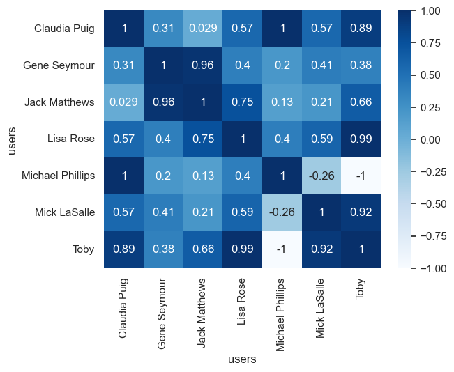

# Pearson correlation

``` python
import numpy as np
import pandas as pd
import seaborn as sns
from sklearn.metrics import pairwise_distances
from sklearn.metrics.pairwise import PAIRWISE_DISTANCE_FUNCTIONS

sns.set()

a = np.array([0, 0])
b = np.array([0.5, 0.5])
c = np.array([1, 1])
d = np.array([1, np.nan])


pairwise_distances(a.reshape(1, -1), b.reshape(1, -1), ensure_all_finite=True)
```

    array([[0.70710678]])

``` python
pairwise_distances(a.reshape(1, -1), c.reshape(1, -1))
```

    array([[1.41421356]])

``` python
pairwise_distances(a.reshape(1, -1), b.reshape(1, -1), metric="cosine")
```

    array([[1.]])

``` python
pairwise_distances(a.reshape(1, -1), c.reshape(1, -1), metric="cosine")
```

    array([[1.]])

``` python
# {'cityblock', 'jaccard', 'cosine', 'braycurtis', 'sokalmichener', 'correlation', 'l1', 'russellrao', 'minkowski', 'rogerstanimoto', 'wminkowski', 'chebyshev', 'nan_euclidean', 'l2', 'sokalsneath', 'mahalanobis', 'dice', 'haversine', 'precomputed', 'seuclidean', 'canberra', 'matching', 'sqeuclidean', 'hamming', 'yule', 'manhattan', 'euclidean'}
pairwise_distances(a.reshape(1, -1), d.reshape(1, -1), metric="nan_euclidean")
```

    array([[1.41421356]])

``` python
PAIRWISE_DISTANCE_FUNCTIONS
```

    {'cityblock': <function sklearn.metrics.pairwise.manhattan_distances(X, Y=None)>,
     'cosine': <function sklearn.metrics.pairwise.cosine_distances(X, Y=None)>,
     'euclidean': <function sklearn.metrics.pairwise.euclidean_distances(X, Y=None, *, Y_norm_squared=None, squared=False, X_norm_squared=None)>,
     'haversine': <function sklearn.metrics.pairwise.haversine_distances(X, Y=None)>,
     'l2': <function sklearn.metrics.pairwise.euclidean_distances(X, Y=None, *, Y_norm_squared=None, squared=False, X_norm_squared=None)>,
     'l1': <function sklearn.metrics.pairwise.manhattan_distances(X, Y=None)>,
     'manhattan': <function sklearn.metrics.pairwise.manhattan_distances(X, Y=None)>,
     'precomputed': None,
     'nan_euclidean': <function sklearn.metrics.pairwise.nan_euclidean_distances(X, Y=None, *, squared=False, missing_values=nan, copy=True)>}

**Disadvantages of Pearson Correlation:**

1.  **Linearity assumption**: Pearson correlation assumes a linear
    relationship between two variables, which may not always be the case
    in real-world data.
2.  **Normality requirement**: Pearson correlation requires normality of
    both variables, which can be problematic if the data is skewed or
    has outliers.
3.  **Assumes equal variances**: Pearson correlation assumes that the
    variances of both variables are equal, which may not be true in all
    cases.
4.  **Sensitive to outliers**: Pearson correlation can be heavily
    influenced by outliers, which can lead to biased results.
5.  **Limited interpretability**: The result of a Pearson correlation
    coefficient does not provide direct insights into the nature of the
    relationship between the two variables.

**Better Alternatives for Similarity Calculation:**

1.  **Kendall’s Tau (K)**: Kendall’s Tau is a non-parametric measure
    that ranks both variables and calculates the proportion of
    concordant pairs. It is less sensitive to outliers and does not
    require normality.
2.  **Spearman’s Rank Correlation Coefficient**: Similar to Kendall’s
    Tau, Spearman’s coefficient also uses ranking but has a different
    interpretation. It measures the number of agreements between
    rankings rather than concordance.
3.  **Mutual Information (MI)**: Mutual Information is a measure that
    calculates the mutual dependence between two variables. It is robust
    to outliers and does not require normality.
4.  **Cosine Similarity**: Cosine similarity uses vector space methods,
    such as cosine distance, to calculate similarities between vectors
    representing data points. This method is particularly useful for
    high-dimensional data.
5.  **Distance-based metrics**: Metrics like Euclidean Distance,
    Mahalanobis Distance, or Minkowski Distance can be used to measure
    similarities between data points.

**When to use each alternative:**

- Use Pearson correlation when the relationship is expected to be linear
  and both variables are normally distributed.
- Use Kendall’s Tau or Spearman’s coefficient when the relationship is
  non-linear or the data has outliers.
- Use Mutual Information when the relationships are complex or
  non-linear, and you want to measure mutual dependence.
- Use Cosine Similarity when working with high-dimensional data or when
  you want to leverage vector space methods.
- Use Distance-based metrics when you need a metric that accounts for
  both magnitude and direction of differences between data points.

In summary, while Pearson correlation is still widely used, it has
limitations. The choice of alternative depends on the nature of your
data, the type of relationship you’re trying to capture, and the
characteristics of your dataset.

``` python
df = pd.read_csv("rating2.csv")
df.head()
```

<div>
<style scoped>
    .dataframe tbody tr th:only-of-type {
        vertical-align: middle;
    }
&#10;    .dataframe tbody tr th {
        vertical-align: top;
    }
&#10;    .dataframe thead th {
        text-align: right;
    }
</style>

|     | users     | movies             | ratings |
|-----|-----------|--------------------|---------|
| 0   | Lisa Rose | Lady in the Water  | 2.5     |
| 1   | Lisa Rose | Snakes on a Plane  | 3.5     |
| 2   | Lisa Rose | Just My Luck       | 3.0     |
| 3   | Lisa Rose | Superman Returns   | 3.5     |
| 4   | Lisa Rose | You, Me and Dupree | 2.5     |

</div>

``` python
user_items = df.pivot(index="users", columns="movies", values="ratings")
user_items
```

<div>
<style scoped>
    .dataframe tbody tr th:only-of-type {
        vertical-align: middle;
    }
&#10;    .dataframe tbody tr th {
        vertical-align: top;
    }
&#10;    .dataframe thead th {
        text-align: right;
    }
</style>

| movies | Just My Luck | Lady in the Water | Snakes on a Plane | Superman Returns | The Night Listener | You, Me and Dupree |
|----|----|----|----|----|----|----|
| users |  |  |  |  |  |  |
| Claudia Puig | 3.0 | NaN | 3.5 | 4.0 | 4.5 | 2.5 |
| Gene Seymour | 1.5 | 3.0 | 3.5 | 5.0 | 3.0 | 3.5 |
| Jack Matthews | NaN | 3.0 | 4.0 | 5.0 | 3.0 | 3.5 |
| Lisa Rose | 3.0 | 2.5 | 3.5 | 3.5 | 3.0 | 2.5 |
| Michael Phillips | NaN | 2.5 | 3.0 | 3.5 | 4.0 | NaN |
| Mick LaSalle | 2.0 | 3.0 | 4.0 | 3.0 | 3.0 | 2.0 |
| Toby | NaN | NaN | 4.5 | 4.0 | NaN | 1.0 |

</div>

``` python
# .corr returns the pearson correlation between columns.
# To find user-user similarity scores, we transpose the user_items DataFrame.
recommendations = user_items.T.corr(
    method="pearson"
)  # "pearson", "kendall", "spearman"
recommendations
```

<div>
<style scoped>
    .dataframe tbody tr th:only-of-type {
        vertical-align: middle;
    }
&#10;    .dataframe tbody tr th {
        vertical-align: top;
    }
&#10;    .dataframe thead th {
        text-align: right;
    }
</style>

| users | Claudia Puig | Gene Seymour | Jack Matthews | Lisa Rose | Michael Phillips | Mick LaSalle | Toby |
|----|----|----|----|----|----|----|----|
| users |  |  |  |  |  |  |  |
| Claudia Puig | 1.000000 | 0.314970 | 0.028571 | 0.566947 | 1.000000 | 0.566947 | 0.893405 |
| Gene Seymour | 0.314970 | 1.000000 | 0.963796 | 0.396059 | 0.204598 | 0.411765 | 0.381246 |
| Jack Matthews | 0.028571 | 0.963796 | 1.000000 | 0.747018 | 0.134840 | 0.211289 | 0.662849 |
| Lisa Rose | 0.566947 | 0.396059 | 0.747018 | 1.000000 | 0.404520 | 0.594089 | 0.991241 |
| Michael Phillips | 1.000000 | 0.204598 | 0.134840 | 0.404520 | 1.000000 | -0.258199 | -1.000000 |
| Mick LaSalle | 0.566947 | 0.411765 | 0.211289 | 0.594089 | -0.258199 | 1.000000 | 0.924473 |
| Toby | 0.893405 | 0.381246 | 0.662849 | 0.991241 | -1.000000 | 0.924473 | 1.000000 |

</div>

``` python
sns.heatmap(recommendations, annot=True, cmap="Blues");
```



``` python
# To find similar users
user = "Claudia Puig"
n = 5

recommendations[user].sort_values(ascending=False).drop(user).head(n)
```

    users
    Michael Phillips    1.000000
    Toby                0.893405
    Lisa Rose           0.566947
    Mick LaSalle        0.566947
    Gene Seymour        0.314970
    Name: Claudia Puig, dtype: float64

The Pearson correlation coefficient is typically written as:

$$\rho = \frac{\sum_{i=1}^{n}(x_i - \bar{x})(y_i - \bar{y})}{\sqrt{\sum_{i=1}^{n}(x_i - \bar{x})^2}\sqrt{\sum_{i=1}^{n}(y_i - \bar{y})^2}}$$

where $x_i$ and $y_i$ are the individual data points, $\bar{x}$ and
$\bar{y}$ are the means of the respective datasets, and $n$ is the
number of data points.

``` python
def pearson(a, b):
    # Only computes the correlation if the values exists in both vector.
    mask = pd.notna(a) & pd.notna(b)
    s1 = a[mask] - a[mask].mean()
    s2 = b[mask] - b[mask].mean()

    return (s1 @ s2) / np.sqrt((s1 @ s1) * (s2 @ s2))
```

``` python
pearson(user_items.iloc[0], user_items.iloc[0])
```

    np.float64(1.0)

``` python
pearson(user_items.iloc[0], user_items.iloc[1])
```

    np.float64(0.314970394174356)

``` python
pearson(user_items.iloc[0], user_items.iloc[4])
```

    np.float64(1.0)
